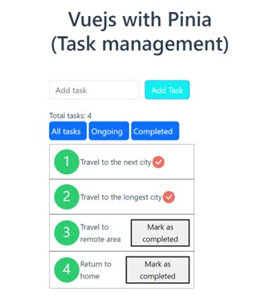

# vuejs_with_pania

This app aim to show how to use Vue with Pinia. This is small Task Management app.
 

## Project Setup

```sh
npm install
```

### Compile and Hot-Reload for Development

```sh
npm run dev
```

### Compile and Minify for Production

```sh
npm run build
```
